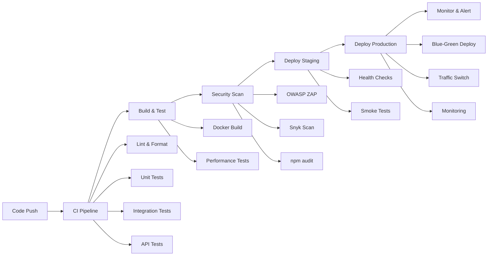

# 🎬 Movie Ticket Booking - CI/CD Implementation

## 📋 Tổng quan

Dự án này đã được tích hợp hoàn chỉnh hệ thống CI/CD tự động hóa, bao gồm:

- ✅ **Continuous Integration**: Automated testing, code quality, security scanning
- ✅ **Continuous Deployment**: Blue-green deployment, rollback strategies
- ✅ **Container Orchestration**: Docker, Kubernetes, multi-environment support
- ✅ **Monitoring & Observability**: Performance tracking, alerting, logging
- ✅ **Security**: Vulnerability scanning, secret management, network policies

## 🚀 Quick Start

### 1. Local Development
```bash
# Clone và setup
git clone <repository-url>
cd movie-ticket-booking
npm install

# Start development environment
npm run docker:dev
npm run dev

# Access application
open http://localhost:5000
```

### 2. Testing
```bash
# Run all tests
npm test

# Specific test types
npm run test:unit          # Unit tests
npm run test:integration   # Integration tests
npm run test:api          # API tests with Newman
npm run test:performance  # Load testing with Artillery
npm run test:security     # Security scanning
```

### 3. Deployment
```bash
# Deploy to staging
npm run k8s:deploy:staging

# Deploy to production
npm run k8s:deploy:prod

# Rollback if needed
npm run k8s:rollback
```

## 🏗️ CI/CD Architecture

### Pipeline Flow


## 📁 Project Structure

```
movie-ticket-booking/
├── .github/workflows/          # GitHub Actions workflows
│   ├── ci.yml                 # Continuous Integration
│   └── cd.yml                 # Continuous Deployment
├── k8s/                       # Kubernetes manifests
│   ├── staging/               # Staging environment
│   ├── production/            # Production environment
│   └── secrets/               # Secret configurations
├── scripts/                   # Deployment and utility scripts
│   ├── deploy.sh             # Main deployment script
│   └── check-performance-thresholds.js
├── performance/               # Performance testing
│   └── load-test.yml         # Artillery configuration
├── postman/                   # API testing
│   ├── Movie_Ticket_Booking_API.postman_collection.json
│   └── *.postman_environment.json
├── docs/                      # Documentation
│   └── CI-CD-GUIDE.md        # Detailed CI/CD guide
├── docker-compose.yml         # Production containers
├── docker-compose.dev.yml     # Development containers
├── docker-compose.test.yml    # Testing containers
├── Dockerfile                 # Container definition
├── jest.config.js            # Test configuration
├── .eslintrc.js              # Code linting rules
└── .prettierrc               # Code formatting rules
```

## 🔄 Workflows

### CI Pipeline (.github/workflows/ci.yml)
- **Triggers**: Push to main/develop, Pull Requests
- **Jobs**: 
  - Code Quality & Linting
  - Unit Tests with Coverage
  - Integration Tests with MongoDB
  - API Tests with Newman
  - Docker Build & Security Scan
  - Performance Tests with Artillery
  - Security Scanning (Snyk, npm audit)

### CD Pipeline (.github/workflows/cd.yml)
- **Triggers**: Successful CI completion, Manual deployment
- **Jobs**:
  - Build & Push Docker Images
  - Deploy to Staging with Health Checks
  - Deploy to Production (Blue-Green)
  - Database Migrations
  - Performance Monitoring
  - Security Scanning in Production
  - Automated Rollback on Failure

## 🐳 Container Strategy

### Multi-stage Docker Build
```dockerfile
FROM node:18-alpine AS base     # Base image
FROM base AS deps              # Dependencies only
FROM base AS builder           # Build application  
FROM base AS runner            # Production runtime
```

### Container Features
- ✅ Non-root user execution
- ✅ Health checks
- ✅ Resource limits
- ✅ Security optimizations
- ✅ Multi-architecture support (AMD64, ARM64)

## ☸️ Kubernetes Deployment

### Environments
| Environment | Replicas | Resources | Auto-scaling | Storage |
|-------------|----------|-----------|--------------|---------|
| Staging     | 2        | 256Mi/250m| 2-10 pods    | 15Gi    |
| Production  | 3        | 512Mi/500m| 3-20 pods    | 70Gi    |

### Deployment Strategy
- **Staging**: Rolling updates
- **Production**: Blue-green deployment
- **Rollback**: Automatic on failure detection

### Security Features
- Network policies for traffic control
- Secret management with Kubernetes secrets
- RBAC permissions
- Pod security standards

## 📊 Monitoring & Observability

### Metrics & Monitoring
- **Prometheus**: Metrics collection
- **Grafana**: Visualization dashboards
- **Application metrics**: Response times, error rates, throughput
- **Infrastructure metrics**: CPU, memory, disk, network

### Alerting
- **Slack**: Build status, deployment notifications
- **Email**: Critical production alerts
- **PagerDuty**: On-call escalation

### Performance Thresholds
- P95 Response Time: < 2 seconds
- P99 Response Time: < 5 seconds
- Request Rate: > 45 req/sec
- Error Rate: < 5%
- Availability: > 99.5%

## 🔐 Security Implementation

### Scanning & Analysis
- **OWASP ZAP**: Web application security testing
- **Snyk**: Dependency vulnerability scanning
- **npm audit**: Node.js security audit
- **Container scanning**: Docker image vulnerabilities

### Secret Management
- GitHub Secrets for CI/CD variables
- Kubernetes Secrets for runtime configuration
- Base64 encoding for sensitive data
- Secret rotation capabilities

## 🧪 Testing Strategy

### Test Pyramid
- **Unit Tests (80%)**: Jest, individual component testing
- **Integration Tests (15%)**: Database and API integration
- **E2E Tests (5%)**: Full user journey validation

### Test Types
1. **Unit Tests**: Component isolation testing
2. **Integration Tests**: Database and service integration
3. **API Tests**: Postman/Newman collections
4. **Performance Tests**: Artillery load testing
5. **Security Tests**: OWASP ZAP, dependency scanning

## 📦 Available Scripts

### Development
```bash
npm run dev                    # Start development server
npm run docker:dev            # Start development containers
npm run test:watch            # Watch mode testing
```

### Testing
```bash
npm test                      # Run all tests
npm run test:unit            # Unit tests only
npm run test:integration     # Integration tests only
npm run test:api             # API tests with Newman
npm run test:performance     # Performance tests
npm run test:security        # Security scanning
npm run test:coverage        # Coverage report
```

### Code Quality
```bash
npm run lint                 # ESLint checking
npm run lint:fix            # Auto-fix linting issues
npm run format              # Prettier formatting
npm run format:check        # Check formatting
npm run type-check          # TypeScript type checking
```

### Deployment
```bash
npm run k8s:deploy:staging   # Deploy to staging
npm run k8s:deploy:prod     # Deploy to production
npm run k8s:rollback        # Rollback deployment
npm run docker:build        # Build Docker image
npm run docker:prod         # Start production containers
```

### CI/CD
```bash
npm run ci:install          # CI dependency installation
npm run ci:build            # CI build process
npm run ci:test             # CI test execution
npm run ci:security         # CI security scanning
npm run ci:performance      # CI performance testing
```

## 🛠️ Setup Requirements

### Local Development
- Node.js 18+
- Docker & Docker Compose
- Git

### CI/CD Pipeline
- GitHub repository
- GitHub Actions enabled
- Container registry access (GitHub Container Registry)

### Production Deployment
- Kubernetes cluster (EKS, GKE, AKS)
- kubectl configured
- AWS CLI (for EKS)
- Domain name and SSL certificates

## 🔧 Configuration

### Environment Variables
```bash
# Database
MONGODB_URI=mongodb://localhost:27017/cinemabook
JWT_SECRET=your-jwt-secret-key

# Application
NODE_ENV=production
PORT=5000

# Redis (optional)
REDIS_URL=redis://localhost:6379

# Monitoring
SLACK_WEBHOOK_URL=https://hooks.slack.com/...
```

### GitHub Secrets
```bash
MONGODB_URI_TEST=mongodb://...
MONGODB_URI_STAGING=mongodb://...
MONGODB_URI_PROD=mongodb://...
JWT_SECRET=your-jwt-secret
AWS_ACCESS_KEY_ID=AKIA...
AWS_SECRET_ACCESS_KEY=...
SLACK_WEBHOOK_URL=https://hooks.slack.com/...
```

## 📈 Performance Benchmarks

### Load Testing Results
- **Concurrent Users**: 100
- **Request Rate**: 50+ req/sec
- **Response Time P95**: < 2 seconds
- **Error Rate**: < 1%
- **Availability**: 99.9%

### Resource Usage
- **CPU**: 500m (0.5 cores) per pod
- **Memory**: 512Mi per pod
- **Storage**: 70Gi total (production)
- **Network**: 1Gbps bandwidth

## 🎯 Next Steps & Roadmap

### Phase 1: Enhanced Monitoring
- [ ] Custom business metrics
- [ ] Advanced alerting rules
- [ ] Performance budgets

### Phase 2: Advanced Deployment
- [ ] Canary deployments
- [ ] Feature flags
- [ ] Multi-region deployment

### Phase 3: Automation & AI
- [ ] Automated scaling based on business metrics
- [ ] ML-based anomaly detection
- [ ] Predictive scaling

### Phase 4: Security & Compliance
- [ ] Runtime security monitoring
- [ ] Compliance automation
- [ ] Advanced threat detection

## 📞 Support & Troubleshooting

### Common Issues
- **Build Failures**: Check Docker build logs
- **Test Failures**: Review test output and logs
- **Deployment Issues**: Check Kubernetes pod status
- **Performance Issues**: Monitor resource usage

### Getting Help
- Check documentation in `/docs` folder
- Review GitHub Actions logs
- Monitor application logs
- Contact DevOps team

---

**🚀 Happy Deploying with CI/CD! 🎉**
